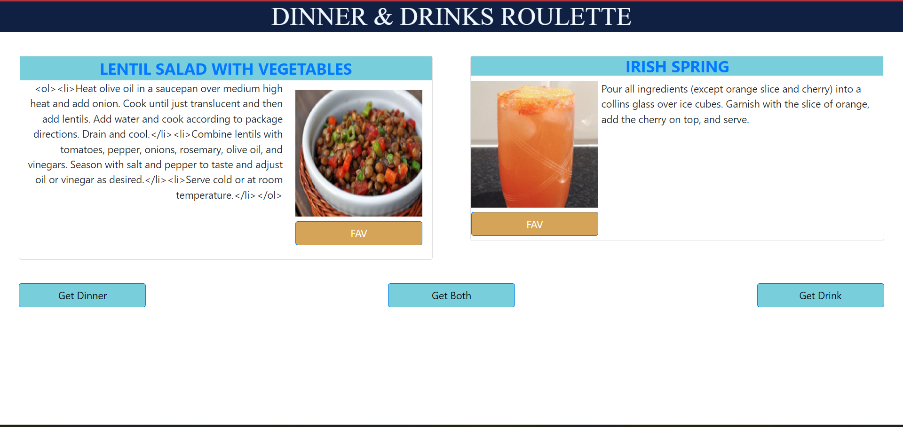

# DINNER AND DRINKS ROULETTE

* [Git Hub](https://github.com/soulslurpee/dinner-and-drinks)
* [Deployed App on GitHub Pages](https://soulslurpee.github.io/dinner-and-drinks/)

### Summary
* This project emphasizes the use of HTML, CSS and JavaScript.
* The app generates random recipes for Dinner and Drinks.
* The following Api's were used to pull the recipes:
* Dinner API: https://spoonacular.com/food-api/docs#Get-Random-Recipes
* Drinks API: https://www.thecocktaildb.com/api.php

### Screenshot:

### To Execute File:
> Open in browser

## Authors

* **Marissa Martinez** - [Git Hub Profile](https://github.com/magical91)
* **Charlie Thompson** - [Git Hub Profile](https://github.com/soulslurpee) 
* **Robbie Kahl** - [Git Hub Profile](https://github.com/shorty008) 
* **Ansab Sidiki** - [Git Hub Profile](https://github.com/asidiki) 

